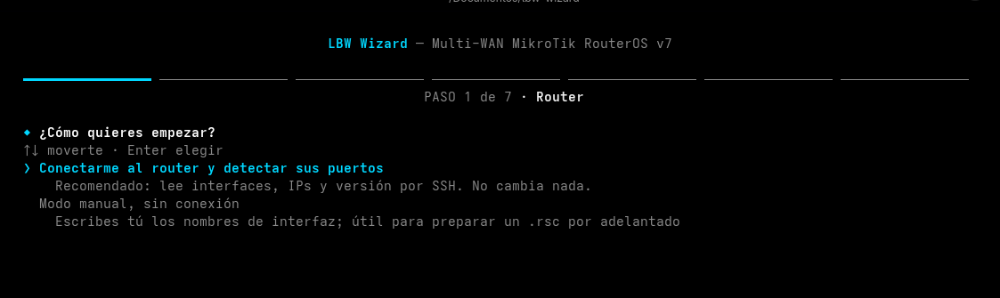
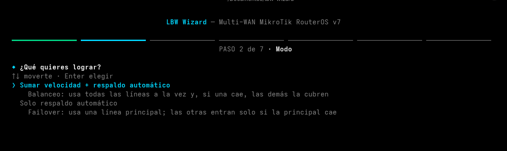
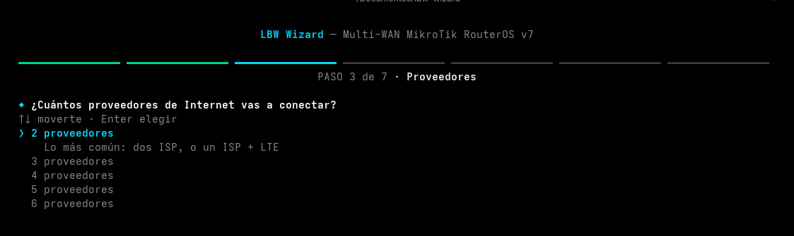
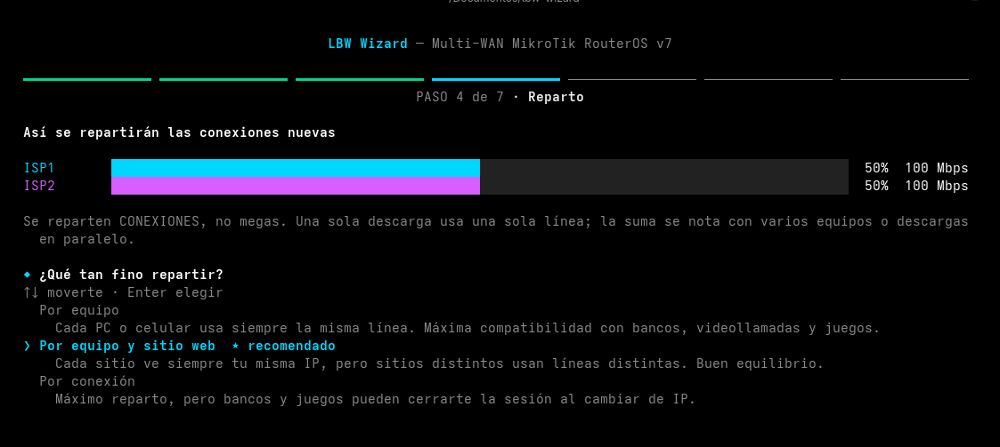
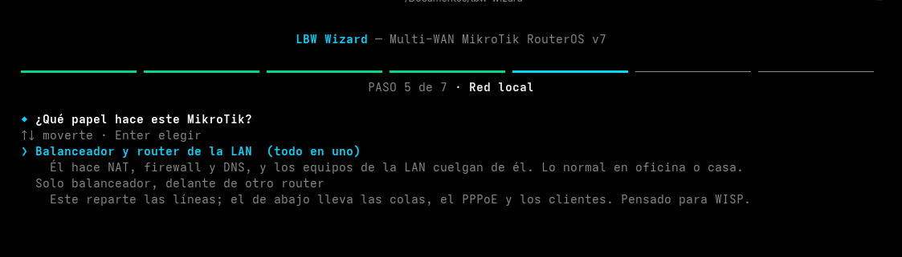
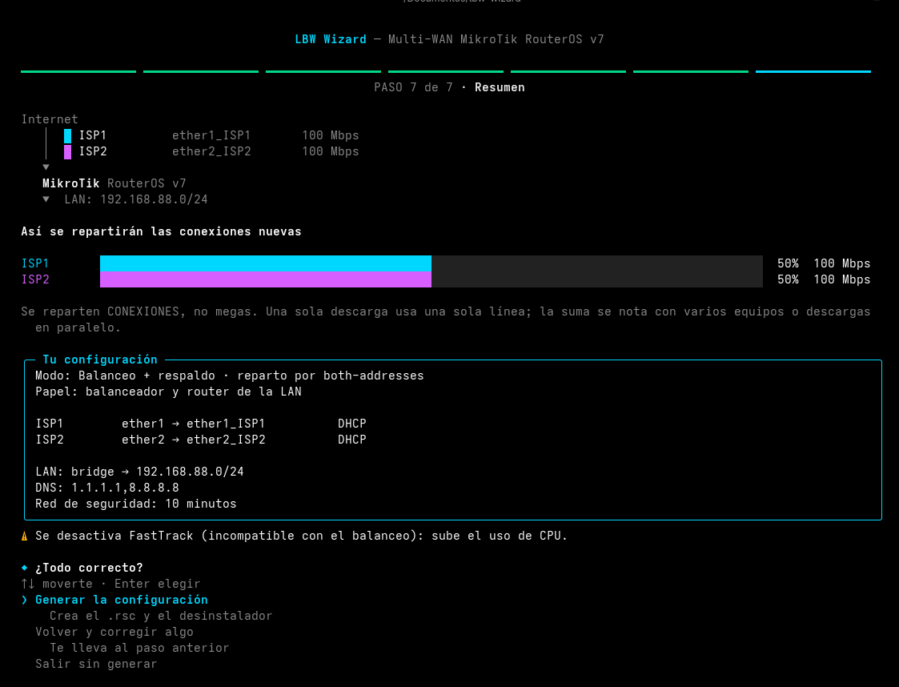

# LBW Wizard — Multi-WAN para MikroTik RouterOS v7

## Así se ve


El asistente va paso a paso, en español, explicando cada decisión en lugar de pedir datos técnicos sueltos.

| | |
|---|---|
|  |  |
|  |  |
|  |  |

Asistente interactivo que genera la configuración de **balanceo de carga (PCC) + failover recursivo** para routers MikroTik con 2 a 6 proveedores de Internet. Pregunta todo paso a paso, revisa el router antes de tocarlo y genera un `.rsc` listo para importar, más su desinstalador.

> Creado por **Nedual Vargas** ([@NEDUALV](https://youtube.com/@NEDUALV))

## Dos formas de montarlo

El asistente pregunta qué papel hace el equipo:

**Balanceador y router de la LAN (todo en uno).** Él reparte las líneas, hace NAT, firewall y DNS, y los equipos cuelgan de él. Es lo normal en casa o en una oficina. Puede usar una LAN que ya exista (el bridge de fábrica, por ejemplo) o **crearla**: bridge, IP, pool y servidor DHCP. Si el router no tiene servidor DHCP, como pasa en un CHR o tras un reset sin configuración, el asistente propone crearla.

**Solo balanceador, delante de otro router.** Pensado para WISP: este equipo reparte las líneas y hace el único NAT del camino; el router de abajo lleva las colas simples, el PPPoE y los clientes.

En modo automático solo eliges dos puertos (el de cada router) y el asistente hace el resto:

- Pone la IP del enlace en una **red /30 que no choque** con ninguna otra del router (por defecto `10.255.255.0/30`; el balanceador es `.1` y el router de abajo `.2`).
- Levanta un DHCP que le entrega esa IP, el gateway y el DNS al router de abajo.
- Enruta de vuelta todo el espacio privado (10.x, 172.16-31.x, 192.168.x), para cubrir cualquier pool de clientes presente o futuro.
- Genera `lbw-router2.rsc`, que deja ese router en ruteo puro, y `lbw-router2-remove.rsc`, que lo devuelve a como estaba.

Si tus clientes usan IP públicas, el modo manual te deja indicar la IP del enlace y las subredes exactas.

> El router de abajo **no debe hacer NAT**. Si enmascara, todas las conexiones llegan al balanceador con una sola IP de origen y el reparto por equipo deja de funcionar.

Las colas simples no se ven afectadas: clasifican por IP de cliente, no por marcas de ruteo. Si usas queue tree con packet-marks en `prerouting`, revisa que tus reglas de marcado queden antes de las de LBW, porque las de `mark-routing` llevan `passthrough=no`.

## Qué hace

**Balanceo y failover**

- Balanceo PCC con reparto según la velocidad contratada de cada línea, y 3 clasificadores explicados en español (por equipo, por equipo+sitio, por conexión)
- Modo solo failover con orden de prioridad
- Failover recursivo con **doble probe por ISP**: la línea solo se da por caída si fallan los dos
- Probes separados de los DNS, para que una caída de probe no deje sin resolución
- Cada tabla de ISP tiene a las demás líneas de respaldo, en orden
- **Fijar equipos o sitios a una línea**: bancos, VoIP, cámaras o un cliente que necesita siempre la misma IP pública. Acepta IP, redes y dominios. Si esa línea cae, el failover igual los mueve

**Interfaces y red**

- Renombra las interfaces conservando el nombre original y agregando `_ISP1`, `_ISP2`… Todas las reglas usan **interface lists**, así que puedes renombrar después sin romper la salida
- Soporta DHCP, IP fija, PPPoE (incluso sobre VLAN del ISP) e interfaces que ya traen su salida (LTE, túneles)
- Saca del bridge el puerto que vayas a usar como WAN, y el desinstalador lo devuelve
- Mete las WAN y la LAN también en las listas `WAN` y `LAN` de fábrica, para que el firewall de fábrica siga funcionando

**Seguridad**

- Firewall básico equivalente al de fábrica de MikroTik, en `input` y en `forward`. Las reglas que aceptan van arriba; las que descartan desde la WAN van al final, para no tapar tus reglas de VPN o port forwards
- **Endurece los servicios**: apaga telnet, ftp, www, api, api-ssl, reverse-proxy, el servidor de bandwidth-test y SMB, y deja SSH y Winbox solo desde las redes de administración (incluida la IP desde la que corres el asistente)
- Si no activas la protección general, igual bloquea el DNS del router desde Internet

**Operación**

- Monitor cada 10 s que limpia las conexiones de la línea caída y avisa por log y, opcionalmente, por Telegram. Espera 60 s tras el arranque para no dar falsas caídas en cada reinicio
- **Log en disco** (`lbw-log`): los eventos de LBW sobreviven a los reinicios
- **Hora por NTP y zona horaria**, para que los eventos del failover se lean sin confusiones
- **Comando de estado** en el router: `/system script run lbw-status`
- Red de seguridad configurable: si no confirmas a tiempo, el router se revierte solo
- Desinstalador que devuelve todo a como estaba (ver la tabla de abajo)

**Antes de tocar nada**

- Detecta si es un **CHR** (virtual) o un **RouterBOARD** físico y adapta las opciones: en CHR no ofrece el reset de fábrica (no tiene) y avisa si la licencia es *free*
- Auditoría del router: FastTrack, rutas por defecto, DHCP clients que instalan su propia ruta, mangle ajeno, tablas de ruteo, NAT sin lista, firewall incompleto, servidor DHCP, hotspot, PPP server, colas y rollbacks pendientes
- Tres formas de arrancar: sobre la configuración actual, con reset de fábrica o con reset total

## Qué cambia en el router

Todo lo que crea LBW lleva un comentario que empieza por `LBW`. Lo que **aparta** de tu configuración lo marca con `PRE-LBW`, para que el desinstalador sepa devolverlo.

| Qué | Cómo lo deja | Marca | El desinstalador… |
|---|---|---|---|
| Interfaces WAN | renombradas `etherX_ISPn` | comentario `LBW:WANn:was=etherX` | devuelve el nombre |
| Puertos WAN que estaban en un bridge | fuera del bridge | address-list `LBW-restore` | los devuelve al bridge |
| DHCP client de cada WAN | sin ruta por defecto, con script que mueve las probes | `LBW:NEW` o `LBW:WANn:adr=…` | lo borra o lo restaura |
| Otros DHCP client con ruta por defecto | distancia 200 (último recurso) | `PRE-LBW-DIST:` | devuelve la distancia |
| Rutas por defecto fijas | deshabilitadas | `PRE-LBW:` | las reactiva |
| NAT masquerade anterior | deshabilitado; se pone uno con `out-interface-list` | `PRE-LBW:` | lo reactiva |
| FastTrack | deshabilitado | `PRE-LBW:` | lo reactiva |
| Rutas, tablas, mangle, NAT y firewall de LBW | nuevos | `LBW:` | los borra |
| LAN creada (bridge-lan, IP, pool, DHCP) | nueva | `LBW:lan` | la borra y devuelve los puertos |
| Enlace del modo balanceador | IP, pool, DHCP y rutas de vuelta | `LBW:link`, `LBW:downstream` | los borra |
| Servicios del router | apagados o limitados | address-list `LBW-restore` (`LBW:svc:`) | los devuelve como estaban |
| Log en disco | acción `lbw-disk` | por nombre | la quita (los archivos `lbw-log` se conservan) |
| DNS del router | servidores elegidos | — | no se revierte |
| NTP y zona horaria | activados | — | no se revierte (es inocuo) |

## Qué no toca

Port forwards (dst-nat), VPN, colas simples y queue tree, leases estáticos, usuarios, IPv6 y reglas de firewall propias. El asistente sí te avisa si algo de eso puede chocar.

## Fijar equipos o sitios a una línea

El asistente pregunta, para cada línea, qué equipos, redes o dominios deben salir siempre por ella. Después puedes añadir más sin volver a correrlo:

```
/ip firewall address-list add list=LBW-fijar-WAN1 address=192.168.88.50
/ip firewall address-list add list=LBW-fijar-WAN2 address=bancobhd.com.do
```

Un equipo de la LAN en la lista sale siempre por esa línea; un sitio (IP pública o dominio) se visita siempre por esa línea. Si la línea cae, esas conexiones pasan a la siguiente, como las demás.

## Comando de estado

```
/system script run lbw-status
```

Muestra, por cada línea: si está en línea, su gateway, cuántas conexiones lleva y cuántos elementos fijados tiene.

## Validación automática

Cada `.rsc` que genera el asistente pasa por un validador estático antes de subirse al router: comprueba balance de comillas, paréntesis y llaves, constructores que RouterOS v7 rechaza (como `[:tobool $bound]`, que devuelve nil), y referencias cruzadas (que cada `routing-table` exista, que cada `interface-list` y `address-list` esté creada, y que los restos del PCC cubran todas las partes). Si no pasa, el asistente no sube nada.

El validador va embebido en el propio `lbw-wizard.sh`: no hay archivos extra que descargar. Si falta `python3`, el asistente lo avisa y sigue sin validar.

No sustituye una prueba en un router real, pero atrapa lo que el import rechazaría.

## Requisitos

- MikroTik con **RouterOS v7**
- Linux o macOS con bash 4+
- Opcional: `sshpass` para no escribir la contraseña en cada conexión (`sudo dnf install sshpass`)

## Uso

Un solo archivo, sin dependencias más allá de bash y ssh:

```bash
chmod +x lbw-wizard.sh && ./lbw-wizard.sh
```

En cualquier pregunta puedes pulsar **Esc** o **←** para volver a la anterior y corregir.

Luego, si no lo aplicaste desde el asistente, en el router (Winbox → New Terminal, con Safe Mode, Ctrl+X):

```
/import file-name=lbw-XXXX.rsc verbose=yes
```

Para revertir:

```
/import file-name=lbw-remove.rsc
```

En modo solo balanceador, en el router de abajo:

```
/import file-name=lbw-router2.rsc verbose=yes
/import file-name=lbw-router2-remove.rsc verbose=yes   # para revertir
```

## La red de seguridad

Al aplicar con la opción recomendada, el asistente arma en el router un scheduler `lbw-rollback`. Si no confirmas **en la terminal del asistente** dentro del plazo que elegiste, el router importa `lbw-remove.rsc` solo y deshace todo.

Si cierras el asistente, se te cae el SSH o importas a mano, desármala tú:

```
/system scheduler remove [find where comment="ROLLBACK-LBW"]
```

## Comprobaciones

```
/system script run lbw-status
/ip route print where comment~"LBW"
/ip firewall mangle print stats where comment~"PCC"
/log print where message~"LBW"
```

Desde un equipo de la LAN, para ver las IP públicas en uso:

```bash
for i in $(seq 1 30); do curl -4 -s --max-time 10 https://ifconfig.me; echo; done | sort | uniq -c
```

Para simular la caída de una línea:

```
/ip route disable [find where comment="LBW:WAN1:PROBE"]
```

## Probado en

| Equipo | RouterOS | Montaje | Qué se probó |
|---|---|---|---|
| CHR en EVE-NG (2 ISP simulados) | 7.17 | todo en uno, LAN creada | failover por caída de enlace y recuperación, sin cortes en un ping continuo; lease perdido y recuperado; reinicio |
| hEX RB750Gr3 | 7.24.5 | solo balanceador, 3 ISP | import completo sobre la configuración de fábrica |

Las funciones nuevas de la v3.1 (red de enlace libre, servicios, fijados, log en disco, NTP, `lbw-status` y el desinstalador del router de abajo) pasan el validador en todos los montajes, pero aún están pendientes de prueba en equipo real.

## Avisos y limitaciones

- **Solo IPv4.** IPv6 no se toca.
- En modo balanceo se desactiva **FastTrack**: es incompatible con el policy routing. En equipos modestos (hEX, hAP) baja el máximo de Mbps; revisa la tabla *Test results* de tu modelo en mikrotik.com.
- **Se reparten conexiones, no megas.** Una sola descarga usa una sola línea; la suma se nota con varios equipos o descargas en paralelo.
- Más de 2 partes de reparto pueden causar pérdida de paquetes de subida en WebRTC (Zoom, Teams, Discord, juegos) si repartes por conexión, porque una misma aplicación puede salir por dos IP públicas distintas. El asistente lo avisa y ofrece partes iguales; repartir por equipo lo evita.
- **Los módems de los ISP no deben compartir subred** (por ejemplo, dos en 192.168.1.x). Si dos WAN reciben la misma red, chocan. Cambia la LAN de uno de los módems.
- **CHR con licencia free**: cada interfaz queda limitada a 1 Mbps de subida. Sirve para probar el failover y el reparto, no para medir velocidad.
- Pruébalo primero en laboratorio (CHR) antes de llevarlo a un cliente.

## Licencia y autoría

Copyright © 2026 Nedual Vargas.
Licenciado bajo **GNU GPL v3 o posterior** — ver [LICENSE](LICENSE) y [NOTICE](NOTICE).
Puedes usarlo, modificarlo y compartirlo **conservando la autoría original** y publicando tus cambios bajo la misma licencia.
